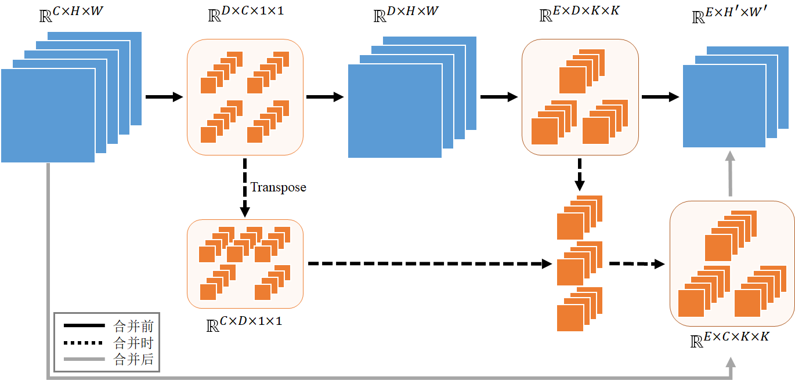
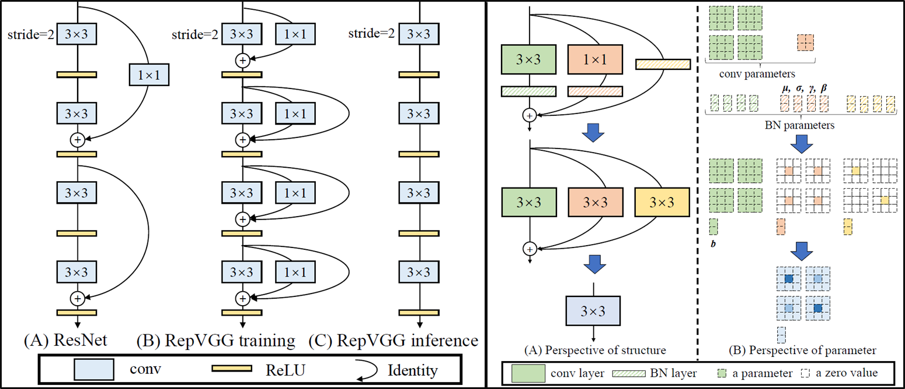
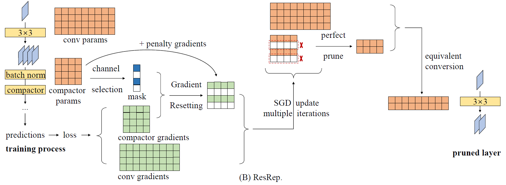
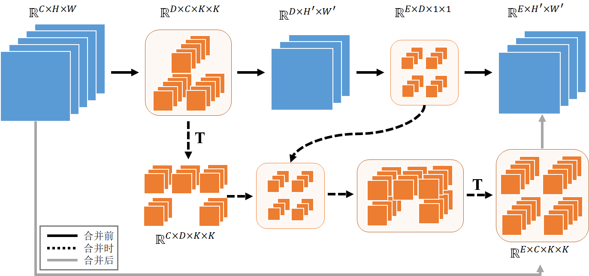

# 重参数化宇宙

*@Author: Xiaohan Ding; Guanchen Li*

> 复现的代码均采用cifar-10分类任务，可以在`data_loader.py`中设置`download=True`进行下载

## 1、什么是重参数化

**结构A对应一组参数X，结构B对应一组参数Y，如果我们能将X等价转换为Y，就能将结构A等价转换为B**

> **在卷积神经网络中，结构指的是：`卷积层`、`block块`等，参数指的是：`卷积核参数`、`BN参数`**
>
> **以卷积层为例**，一个输入通道数为$I$，输出通道数为$O$，卷积核大小为$K×K$的卷积层，其参数可以表示为：$W \in \mathbb{R}^{O×I×K×K}$，此时张量$W$就和这个卷积层(结构)建立了一对一的关系。既然一组参数和一个结构是一一对应的，我们就可以通过将一组参数转换为另一组参数来将一个结构转换为另一个结构。例如，如果我们通过某种办法把 $W$ 变成了一个$(\frac{O}{2})×I×K×K$的张量，那这个卷积层自然就变成了一个输出通道为$\frac{O}{2}$的卷积层。
>
> **以全连接层为例**，两个全连接层之间如果没有非线性的话就可以转换为一个全连接层。设这两个全连接层的参数为矩阵 $A$ 和 $B$ ，输入为 $x$ ，则输出为 $y=B(Ax)$。我们可以构造 $C=BA$，则有 $y=B(Ax)=Cx$ 。那么 $C$ 就是我们得到的全连接层的参数。

## 2、重参数化怎么用

**首先构造一系列结构（一般用于训练），并将其参数等价转换为另一组参数（一般用于推理），从而将这一系列结构等价转换为另一系列结构。其中，训练结构相对复杂，用于在训练过程中充分学习数据的模式；推理结构相对简单，用于达到更高的推理速度和更轻量化的模型存储。一般的思路是：限定使用某个轻量级的、简单的模型进行推理，通过等价转换，模型中的简单结构转换为学习能力更强的复杂结构，使用复杂结构进行训练，获得较强的性能，在进行等价的“反”转换，使推理模型获得和训练时同样水准的性能**

在模型压缩的领域中，可以视为在传统思路——**`思路1`**的基础上，提供了新思路——**`思路2`**


## 3、ACNet

### 3.1 基本思想


Asymmetric Convolution Networks (AVNet)在训练过程中，使用三个平行的卷积核进行卷积计算，这三个卷积核的大小分别是3×3、1×3和3×1，在推理应用中，将所有的平行卷积核element-wise相加合并，使其形成一个3×3的卷积核，网络结构简单化，能够加速推理并减少网络大小。

### 3.2 数学证明

三个平行卷积核相加为单个卷积核是一种**等价**转换，证明如下：

记卷积过程如下（卷积核为$F \in \mathbb{R}^{C×H×W}$，输入特征图为$M \in \mathbb{R}^{C×U×V}$，输出特征图为$O \in \mathbb{R}^{D×R×T}$，$*$表示卷积操作）：
$$
\boldsymbol{O}_{j,:,:}=\sum_{k=1}^{C} \boldsymbol{M}_{k,:,:} * \boldsymbol{F}_{k,:,:}^{(j)}
$$
两次与卷积核进行卷积操作，并将其输出特征图element-wise相加，和卷积核element-wise相加，再进行卷积操作输出特征图，是等价的，数学语言表达如下（其中$I$是输入特征图，$K$是卷积核，$\oplus$表示element-wise相加，这个式子必须满足$K$与$K$的兼容性）：
$$
\boldsymbol{I} * \boldsymbol{K}^{(1)}+\boldsymbol{I} * \boldsymbol{K}^{(2)}=\boldsymbol{I} *\left(\boldsymbol{K}^{(1)} \oplus \boldsymbol{K}^{(2)}\right)
$$
如下图所示，“兼容性”（conv2核以及conv3核能够兼容conv1核）指的是（**conv2/3核可以看作conv1核部分行列固定为0的结果**）：

* conv2/3核的滑动规则和conv1核一致
* conv2/3核的大小不超过conv1核
* conv2/3核的数量和conv1核一致


兼容性（核可相加）的根本原因在于：对于$\boldsymbol{O}_{j,:,:}$中的一个确切点$y$，其值的计算过程如下。**卷积操作的微观是乘法和加法的组合，所以其宏观上也满足乘法和加法的交换律和分配律。**
$$
y=\sum_{c=1}^{C} \sum_{h=1}^{H} \sum_{w=1}^{W} F_{h, w, c}^{(j)} X_{h, w, c}
$$

### 3.3 考虑BN层

将现代BN层操作考虑进来，一次卷积操作可如下表示：
$$
\boldsymbol{O}_{j,:,:}=\left(\sum_{k=1}^{C} \boldsymbol{M}_{k,:,:} * \boldsymbol{F}_{k,:,:}^{(j)}-\mu_{j}\right) \frac{\gamma_{j}}{\sigma_{j}}+\beta_{j}
$$
BN参数可以很容易地和卷积操作融合在一起，BN-fusion操作是BN参数和卷积公式展开的过程，branch-fusion操作是将卷积核element-wise相加地过程(其偏置也需要element-wise相加)，如以下公式和图片所示：
$$
\boldsymbol{F}^{\prime(j)}=\frac{\gamma_{j}}{\sigma_{j}} \boldsymbol{F}^{(j)} \oplus \frac{\bar{\gamma}_{j}}{\bar{\sigma}_{j}} \overline{\boldsymbol{F}}^{(j)} \oplus \frac{\hat{\gamma}_{j}}{\hat{\sigma}_{j}} \hat{\boldsymbol{F}}^{(j)}
$$

$$
b_{j}=-\frac{\mu_{j} \gamma_{j}}{\sigma_{j}}-\frac{\bar{\mu}_{j} \bar{\gamma}_{j}}{\bar{\sigma}_{j}}-\frac{\hat{\mu}_{j} \hat{\gamma}_{j}}{\hat{\sigma}_{j}}+\beta_{j}+\bar{\beta}_{j}+\hat{\beta}_{j}
$$


## 4、DBB

### 4.1 基本思路

**Diverse Branch Block (DBB)，在ACNet的基础上，将一个N×N的卷积层，使用一个更复杂的Inception Block替代其训练过程中的角色，达到更加出色的性能。**


### 4.2 等价转换

DBB相比ACNet，涉及到更多结构的等价转换，如串行结构和池化参与的结构，作者将其内部结构细分为六个种类，分别介绍其等价转换方法，如下图所示：


*其中**TransformⅠ**、**TransformⅡ**和**TransformⅥ**已经在ACNet中涉及到，就不再赘述。（代码实现如下）*

```python
def transI_fusebn(kernel, bn):
    gamma = bn.weight
    std = (bn.running_var + bn.eps).sqrt()
    fused_kernel = kernel * ((gamma / std).reshape(-1, 1, 1, 1))
    fused_bias = bn.bias - bn.running_mean * gamma / std
    return fused_kernel, fused_bias

def transII_addbranch(kernels, biases):
    return sum(kernels), sum(biases)

def transVI_multiscale(kernel, target_kernel_size):
    H_pixels_to_pad = (target_kernel_size - kernel.size(2)) // 2
    W_pixels_to_pad = (target_kernel_size - kernel.size(3)) // 2
    return F.pad(kernel, [H_pixels_to_pad, H_pixels_to_pad, W_pixels_to_pad, W_pixels_to_pad])
```

分别介绍不同结构的等价转换方法如下（记$\boldsymbol{I}$为输入，$\boldsymbol{O}^{\prime}$为输出，$\boldsymbol{F}$为卷积核，$\boldsymbol{b}$为偏置，$REP$为广播操作）

 > #### **TransformⅢ：1×1Conv -- BN -- K×KConv  =  K×KConv**

$$
\boldsymbol{O}^{\prime}=\left(\boldsymbol{I} \circledast \boldsymbol{F}^{(1)}+\operatorname{REP}\left(\boldsymbol{b}^{(1)}\right)\right) \circledast \boldsymbol{F}^{(2)}+\operatorname{REP}\left(\boldsymbol{b}^{(2)}\right)\\
\ \ \ \ \ \ \ \ \ \ \ 
=\boldsymbol{I} \circledast \boldsymbol{F}^{(1)} \circledast \boldsymbol{F}^{(2)}+\operatorname{REP}\left(\boldsymbol{b}^{(1)}\right) \circledast \boldsymbol{F}^{(2)}+\operatorname{REP}\left(\boldsymbol{b}^{(2)}\right)
$$

**合并公式的第一部分**：由于$\boldsymbol{F}^{(1)}$是1×1卷积核，它和输入的卷积操作其实只是在做线性组合，所以它的参数可以和$\boldsymbol{F}^{(2)}$合并，合并过程如下图所示。



证明合并前后输出结果的一致性（采用数理证明太抽象，实用程序验证如下）：

```python
import torch
import torch.nn as nn
from torch.nn.parameter import Parameter

torch.manual_seed(0)

input = torch.rand((1, 5, 10, 10))

# 计算变换前的结果
conv_4_5_1_1 = nn.Conv2d(in_channels=5, out_channels=4, kernel_size=(1, 1), bias=False)
conv_3_4_3_3 = nn.Conv2d(in_channels=4, out_channels=3, kernel_size=(3, 3), bias=False)
before_result = conv_3_4_3_3(conv_4_5_1_1(input))

# 计算变换后的结果
# 转置得到conv_5_4_1_1
conv_5_4_1_1 = nn.Conv2d(in_channels=4, out_channels=5, kernel_size=(1, 1), bias=False)
conv_5_4_1_1.weight = Parameter(conv_4_5_1_1.weight.transpose(0, 1))
# 使用conv_5_4_1_1对卷积核conv_3_4_3_3进行卷积操作
weights_of_conv_3_5_3_3 = conv_5_4_1_1(conv_3_4_3_3.weight)
conv_3_5_3_3 = nn.Conv2d(in_channels=5, out_channels=3, kernel_size=(3, 3), bias=False)
conv_3_5_3_3.weight = Parameter(weights_of_conv_3_5_3_3)
after_result = conv_3_5_3_3(input)

print((abs(before_result - after_result).sum()))  # 显示二者绝对值误差为4.1042e-06，足够小
```

此时可以记  $
\boldsymbol{F}^{\prime} \leftarrow \boldsymbol{F}^{(2)} \circledast \operatorname{TRANS}\left(\boldsymbol{F}^{(1)}\right)
$

**合并公式的第二、三部分**：由于偏置矩阵的每个元素是相同的数，所以单个偏置矩阵进行卷积操作，就相当于这个元素的值和sum(卷积核)相乘，于是我们可以这样定义$\boldsymbol{b}^{\prime}$:
$$
\hat{b}_{j} \leftarrow \sum_{d=1}^{D} \sum_{u=1}^{K} \sum_{v=1}^{K} \boldsymbol{b}_{d}^{(1)} \boldsymbol{F}_{j, d, u, v}^{(2)},\ \ \ \ \  1 \leq j \leq E
$$

$$
\operatorname{REP}\left(\boldsymbol{b}^{(1)}\right) \circledast \boldsymbol{F}^{(2)}=\operatorname{REP}(\hat{\boldsymbol{b}})
$$

$$
b^{\prime} \leftarrow \hat{b}+b^{(2)}
$$

注意：如果K×K的卷积核带有全零padding，以上公式将不再试用，解决办法如下：

* 第一个卷积(1×1)使用padding，第二个卷积(K×K)不用padding
* 使用$\boldsymbol{b}^{(1)}$的值进行padding，分为如下几步：
  * 第一个卷积后的BN层正常计算
  * 进行BN-fusion，得到$\boldsymbol{b}^{(1)}$
  * 使用$\boldsymbol{b}^{(1)}$对第二次卷积进行padding

程序实现如下所示：

```python
def transIII_1x1_kxk(k1, b1, k2, b2, groups):
    if groups == 1:
        k = F.conv2d(k2, k1.permute(1, 0, 2, 3))      #
        b_hat = (k2 * b1.reshape(1, -1, 1, 1)).sum((1, 2, 3))
    else:
        k_slices = []
        b_slices = []
        k1_T = k1.permute(1, 0, 2, 3)
        k1_group_width = k1.size(0) // groups
        k2_group_width = k2.size(0) // groups
        for g in range(groups):
            k1_T_slice = k1_T[:, g*k1_group_width:(g+1)*k1_group_width, :, :]
            k2_slice = k2[g*k2_group_width:(g+1)*k2_group_width, :, :, :]
            k_slices.append(F.conv2d(k2_slice, k1_T_slice))
            b_slices.append((k2_slice * b1[g*k1_group_width:(g+1)*k1_group_width].reshape(1, -1, 1, 1)).sum((1, 2, 3)))
        k, b_hat = transIV_depthconcat(k_slices, b_slices)
    return k, b_hat + b2
```

> #### **Transform Ⅳ：卷积的结果在通道维度拼接**

当两个相同规格卷积核的卷积结果进行拼接时，相当于先拼接两个卷积核，再进行卷积操作得出结果：
$$
\begin{aligned}
&\operatorname{CONCAT}\left(\boldsymbol{I} \circledast \boldsymbol{F}^{(1)}+\operatorname{REP}\left(\boldsymbol{b}^{(1)}\right), \boldsymbol{I} \circledast \boldsymbol{F}^{(2)}+\operatorname{REP}\left(\boldsymbol{b}^{(2)}\right)\right)
=\boldsymbol{I} \circledast \boldsymbol{F}^{\prime}+\operatorname{REP}\left(\boldsymbol{b}^{\prime}\right)
\end{aligned}
$$
其中：$\boldsymbol{F}^{(1)} \in \mathbb{R}^{D_{1} \times C \times K \times K}$；$\boldsymbol{b}^{(1)} \in \mathbb{R}^{D_{1}}$；$\boldsymbol{F}^{(2)} \in \mathbb{R}^{D_{2} \times C \times K \times K}$；$b^{(2)} \in \mathbb{R}^{D_{2}}$；$\boldsymbol{F}^{\prime} \in \mathbb{R}^{\left(D_{1}+D_{2}\right) \times C \times K \times K}$；$b^{\prime} \in \mathbb{R}^{D_{1}+D_{2}}$

Transform Ⅳ给分组卷积（Alex认为group conv的方式能够增加 filter之间的对角相关性，而且能够减少训练参数，不容易过拟合，这类似于正则的效果）提供了思路，在DBB中，1×1-K×K卷积就同时使用了分组卷积的技术，如下图所示。


程序实现如下所示：

```python
def transIV_depthconcat(kernels, biases):
    return torch.cat(kernels, dim=0), torch.cat(biases)
```

> #### **Transform Ⅴ：卷积替代平均池化**

一个核大小为K，步长为s，应用于C个输入通道的平均池化，可以用同样核大小，同样步长，同样输入通道数的卷积核代替：$\boldsymbol{F}^{\prime} \in \mathbb{R}^{C \times C \times K \times K}$，这个卷积核的参数值满足：
$$
\boldsymbol{F}_{d, c,:,:}^{\prime}= \begin{cases}\frac{1}{K^{2}} & \text { if } d=c \\ 0 & \text { elsewise }\end{cases}
$$
这个卷积核可以达到和平均池化相同的效果：s > 1时下采样，s = 1是平滑。

程序实现如下所示：

```python
def transV_avg(channels, kernel_size, groups):
    input_dim = channels // groups
    k = torch.zeros((channels, input_dim, kernel_size, kernel_size))
    k[np.arange(channels), np.tile(np.arange(input_dim), groups),:,:] = 1.0 / kernel_size ** 2
    return k
```

## 5、RepVGG

### 5.1 基本思路

RepVGG受到ResNet启发，ResNet结构可以看作训练一个$y=g(x)+f(x)$，当前后大小一致时$g(x)=x$，$g()$是一个1×1的卷积，RepVGG的训练过程即使训练一个类似的$y = x+g(x)+f(x)$,



定义输入、参数的维度如下图所示：


合并过程如下所示：
$$
\begin{aligned}
\mathrm{M}^{(2)} =
\begin{cases}\mathrm{bn}\left(\mathrm{M}^{(1)} * \mathrm{~W}^{(3)}, \mu^{(3)}, \sigma^{(3)}, \gamma^{(3)}, \beta^{(3)}\right) +\mathrm{bn}\left(\mathrm{M}^{(1)} * \mathrm{~W}^{(1)}, \mu^{(1)}, \sigma^{(1)}, \gamma^{(1)}, \beta^{(1)}\right) +\mathrm{bn}\left(\mathrm{M}^{(1)}, \mu^{(0)}, \sigma^{(0)}, \gamma^{(0)}, \beta^{(0)}\right) & \text { if } C_1=C_2,\ H_1=H_2,\ W_1=W_2 \\ \begin{aligned}
\mathrm{bn}\left(\mathrm{M}^{(1)} * \mathrm{~W}^{(3)}, \mu^{(3)}, \sigma^{(3)}, \gamma^{(3)}, \beta^{(3)}\right) +\operatorname{bn}\left(\mathrm{M}^{(1)} * \mathrm{~W}^{(1)}, \mu^{(1)}, \sigma^{(1)}, \gamma^{(1)}, \beta^{(1)}\right)
\end{aligned} & \text { elsewise }\end{cases}
\end{aligned}
$$

## 6、ResRep

### 6.1 基本思路

如下图所示，ResRep在所有的**3×3卷积核**后添加了一个**compactor**(是一个**1×1的卷积核**，被初始化为一个**单位矩阵**，这使得初始化后的网络**前向传播完全不变**；若3×3卷积核后紧跟了**BN层**，则compactor就添加在BN层以后)，ResRep只给这个compactor添加**“学习如何剪枝”**的梯度，使其部分行接近于零，而不改变原始网络结构的任何细节，当网络重新收敛后，将3×3卷积核--[BN层]--compactor融合成一个3×3卷积核，融合后，compactor全零行对应的多个3×3卷积核也被置零，达到剪枝目的。




### 6.2 3×3卷积核--[BN层]--compactor的融合

等价转换过程如下图所示：



证明合并前后输出结果的一致性（采用数理证明太抽象，实用程序验证如下）：

```python
import torch
import torch.nn as nn
from torch.nn.parameter import Parameter

torch.manual_seed(0)

input = torch.rand((1, 5, 10, 10))

# 计算变换前的结果
conv_3_5_3_3 = nn.Conv2d(in_channels=5, out_channels=3, kernel_size=(3, 3), bias=False)
conv_4_3_1_1 = nn.Conv2d(in_channels=3, out_channels=4, kernel_size=(1, 1), bias=False)
before_result = conv_4_3_1_1(conv_3_5_3_3(input))

# 计算变换后的结果
# 转置得到conv_5_3_3_3
weight_of_conv_3_5_3_3 = conv_3_5_3_3.weight
weight_of_conv_5_3_3_3 = weight_of_conv_3_5_3_3.transpose(0, 1)
conv_5_3_3_3 = nn.Conv2d(in_channels=3, out_channels=5, kernel_size=(3, 3), bias=False)
conv_5_3_3_3.weight = Parameter(weight_of_conv_5_3_3_3)
# 使用conv_4_3_1_1对卷积核conv_5_3_3_3进行卷积操作
weights_of_conv_5_4_3_3 = conv_4_3_1_1(conv_5_3_3_3.weight)
conv_5_4_3_3 = nn.Conv2d(in_channels=4, out_channels=5, kernel_size=(3, 3), bias=False)
conv_5_4_3_3.weight = Parameter(weights_of_conv_5_4_3_3)
# 再转置
weights_of_conv_4_5_3_3 = conv_5_4_3_3.weight.transpose(0, 1)
conv_4_5_3_3 = nn.Conv2d(in_channels=5, out_channels=4, kernel_size=(3, 3), bias=False)
conv_4_5_3_3.weight = Parameter(weights_of_conv_4_5_3_3)
after_result = conv_4_5_3_3(input)

print((abs(before_result - after_result).sum()))  # 显示二者绝对值误差为4.6354e-06，足够小
```

### 6.3 compactor如何学习剪枝

在构造好含有compactor组件的网络后，正常按照损失函数计算所有梯度，梯度反向传播之前，手动给改变所有compactor组件的梯度，其梯度如下所示：
$$
G(\boldsymbol{F}) \leftarrow \frac{\partial L_{\mathrm{perf}}(X, Y, \boldsymbol{\Theta})}{\partial \boldsymbol{F}} m+\lambda \frac{\boldsymbol{F}}{\|\boldsymbol{F}\|_{E}}
$$
其中$\boldsymbol{F}$表示卷积核参数集，$\boldsymbol{\Theta}$表示全体参数集，$L_{\mathrm{perf}}$表示原始损失函数，这个损失函数仅关注与如何提升性能，而不关注如何剪枝，公式的第二项是指导剪枝的惩罚项，$m$是一个掩码，它的值等于0或1，当$m=0$时，可以消除训练中的对抗成分，让“温柔的”惩罚也可以指导不重要的卷积核参数降为零。

改变梯度后，让梯度反向传播更新网络，不断循环迭代，直到达到我们想要的剪枝率即可。在进行一定次数的迭代后，我们可以得到一个集合：
$$
M = \{ ||Q_{j,:}^{(i)}||_{2} \ |1\leq{i}\leq{n};1\leq{j}\leq{D^{(i)}}\}
$$
其中$D^{(i)}$表示compactor的总个数；$j$表示一个compactor的行数(卷积核数)，我们将$M$从小到大排列，将足够接近0的$j$对应的卷积核完全置零，并进行等价转换
